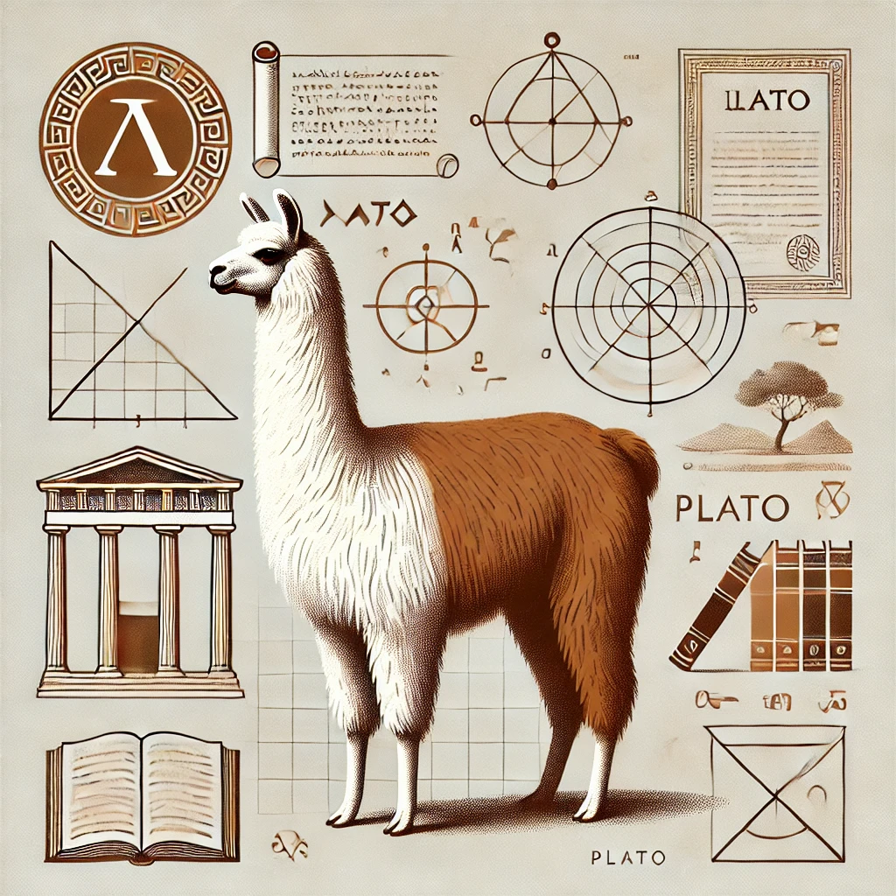

# Mini-LLaMA Model With Plato

This project is a mini recreation of the open-source LLaMA model from Meta, trained on textual data of Plato.

The dataset is available on Kaggle [here](https://www.kaggle.com/datasets/kouroshalizadeh/history-of-philosophy). 

This project was completed in reference to these sources:

*   https://github.com/ES7/LLaMA-from-Scratch/tree/main
*   https://medium.com/@sayedebad.777/building-llama-from-scratch-a-step-by-step-guide-d1922b0670c1
*   https://medium.com/@sayedebad.777/training-the-llama-model-from-scratch-4100d35fa622
*   https://www.youtube.com/watch?v=Mn_9W1nCFLo

